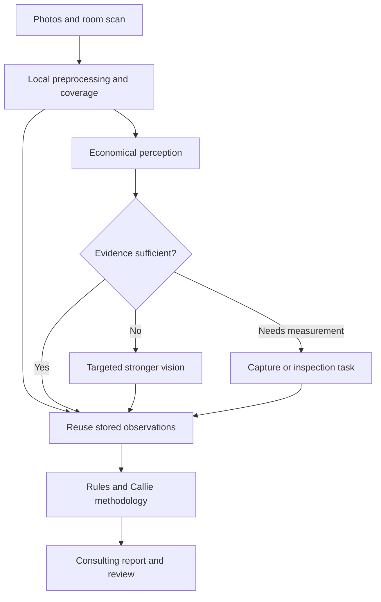

# Kitchen Vision — Inference Cost Reduction and Lessons from God's Eye View

> Research date: 2026-10-04 (America/Chicago)
> Status: Architecture proposal; savings require measurement.
> Destination: `codeslp/space_scanner/research`, the connected school-kitchen assessment project.
> Scope: Reduce visual inference and repeated context costs while preserving useful consulting evidence.

## 1. Recommendation and evidence boundaries

Compile each kitchen assessment into a persistent, evidence-linked representation. Perform inexpensive preprocessing and perception once, reuse observations for subsequent questions, and invoke stronger vision only for unresolved visual questions. Callie's consulting layer should normally receive structured observations and selected methodology, with access to source photos whenever interpretation needs verification.

God's Eye View provides useful patterns for bounded visual context and cost accounting. It is not a kitchen perception model, commercial-equipment detector, or assessment engine. Adopt its ideas selectively rather than importing the globe application.

This document distinguishes three evidence classes:

- **Verified upstream behavior:** inspected source in the original [bilawalsidhu/gods-eye-view repository](https://github.com/bilawalsidhu/gods-eye-view), with source links pinned to commit `e1cc7afacfd0e431d42d66f3b93c1f98c3e8a76d`.
- **Verified project context:** the existing research plan, CV inventory, and selected Swift files in this repository.
- **Proposed Kitchen Vision behavior:** the cascade, evidence schema, budgets, routing policy, and experiment design below.

The current production token bill, Zo workflow, prompts, model settings, and retry behavior were not available. The inspected Swift service performs Apple Vision OCR; it does not establish where the reported production token spend originates. This is a research proposal, not a completed cost audit.

## 2. Corrections to the earlier discussion

| Earlier claim | Research finding |
|---|---|
| The project link was `Yuser00123/God-eye` | That copy's README points to the original `bilawalsidhu/gods-eye-view` repository. Use the original as the reference. |
| The 64 × 36 hash avoids repeated AI analysis | The inspected implementation uses FNV-1a over downsampled RGB pixels to skip unchanged CCTV canvas redraws and texture uploads. Using a similar gate before inference is our adaptation. It is not semantic deduplication. |
| Low detail always reduces image tokens | OpenAI's current documentation says behavior depends on model; some detail settings share limits and some low settings can use more tokens than high. Measure the exact model/detail combination. [S6] |
| Gemini can analyze a kitchen for $0.0006/image | That listed amount is image input for Gemini 3 Pro Image batch/flex pricing, an image-generation model, and excludes text/output costs. It is not a complete kitchen-analysis price. [S7] |
| A 5–20× reduction is likely | No production baseline supports that forecast. Treat substantial savings as a hypothesis until measured. |
| Local processing costs $0 | It avoids hosted-model token charges but still consumes device/server compute, memory, engineering time, and potentially GPU expense. |

## 3. What God's Eye View actually contributes

| Verified pattern | Evidence | Kitchen Vision adaptation |
|---|---|---|
| Selectively attach a viewport image when structured identity is insufficient | `realtimeViewport.js` gates capture by action, view scale, and structured identity. [S1] | Query stored observations first; fetch pixels for a specific unresolved question. |
| Bound image size and transport payload | Capture is limited to 1,080,000 pixels and 200 KiB estimated decoded JPEG payload. [S1] | Set model-specific image budgets and preserve originals for later crops. These upstream limits are transport choices, not universal optimal inference settings. |
| Retain at most one viewport screenshot | The previous screenshot is deleted before a replacement is added. [S1] | Prevent old images from accumulating in repeated model requests. Saving an image URL alone does not guarantee free reuse. |
| Detect unchanged camera frames cheaply | A small RGB frame signature avoids redundant rendering work. [S2] | Combine exact-content hashes with approximate similarity and coverage checks before selecting images for inference. |
| Fetch live state instead of retaining an enormous history | Example configuration uses a 3,000-token conversation window, 0.5 retention, and a separate HUD summary model. [S3] | Retrieve current assessment state and relevant domain excerpts per task; choose our context budget through evaluation. |
| Account for spend by model and modality | Cost code separates cached/uncached text, audio, and image usage and latches warning/cap crossings. [S4] | Record actual provider usage per pipeline step and enforce assessment budgets on the server. |

The upstream voice tracker can mark accounting incomplete when a response ends before usage arrives. Its cap is triggered after reported usage; it cannot guarantee that an in-flight request never overshoots. Kitchen Vision needs pre-call reservations and bounded concurrency in addition to post-call reconciliation.

The upstream MIT license covers source code, while bundled datasets and assets have separate terms. If code is copied, retain required notices. There is no reason to carry the project's third-party geographic data into this product. [S5]

## 4. Proposed assessment pipeline



### 4.1 Preprocess and select evidence

Normalize orientation, reject unusable frames, generate bounded thumbnails, and preserve originals. Compute exact hashes for identical inputs. Use perceptual hashes or embeddings to propose similar-image clusters, then select sharp representatives.

Do not discard an alternate angle simply because it resembles another photograph. It may reveal a blocked sink, label, connection, clearance, or hidden surface. Preserve cluster membership and require zone/object coverage before reducing evidence. Hash similarity is a selection signal, not proof that two views contain the same relevant facts.

For video, select frames using camera movement, blur, scene changes, and coverage rather than fixed continuous premium-model calls.

### 4.2 Use the existing on-device capabilities first

The repository already contains:

- `VisionProcessingService.swift`: Apple Vision text recognition on camera pixel buffers, with an in-flight processing guard.
- `KitchenAssessment.swift`: room capture, detected labels, equipment-list placeholders, and spatial-rule fields.
- `01_CV_CAPABILITIES.md`: a proposed hybrid of geometry, detection, OCR, rules, and visual reasoning.

Reuse OCR and measured room geometry when available. Do not ask a language model to reread a clear label or estimate a dimension already measured. Keep measurement method, units, timestamp, and uncertainty.

Generic detectors may identify broad equipment categories but need evaluation or training for commercial variants. A detected sink does not establish that it is a handwashing sink. Absence from a partial view does not establish missing equipment.

### 4.3 Economical perception, then selective escalation

The first hosted pass should extract concise observations, evidence references, visibility limitations, and unresolved questions. Keep consulting prose out of this stage.

Escalate when a materially important observation is ambiguous, OCR conflicts with equipment identity, another view contradicts the first, or the requested task needs detail unavailable in the stored evidence. Use a padded crop plus a scene overview when surrounding context matters.

Do not route using self-reported LLM confidence alone. Calibrate against labeled examples and include blur, coverage, conflicting detections, and missing measurements. If the evidence is inadequate, request another photo or physical inspection; a more expensive model cannot recover unseen facts.

### 4.4 Separate facts, rules, and consulting judgment

The rules layer evaluates applicable, sourced criteria against measured or supported observations. Callie's layer synthesizes those facts using her methods, tradeoffs, and examples.

Retrieve only the relevant research sections and district context. Avoid attaching the entire research folder, all previous conversations, and all photos to every request.

Text observations are a lossy representation. Keep a path back to source images for new questions, contradictions, and human review. Describe visible concerns as candidates for review; do not turn inferred dimensions or visual guesses into definitive violations.

## 5. Persistent evidence representation

Start with ordinary relational tables and JSON fields. A dedicated graph database is optional.

| Record | Minimum fields |
|---|---|
| Capture | tenant, assessment, image ID, exact hash, original URI, dimensions, time, zone |
| Derived image | original ID, crop rectangle, scale/orientation transform, preprocessing version |
| Observation | object/zone, type, value, evidence IDs, visibility, uncertainty, extractor version |
| Measurement | value, units, method, uncertainty, source IDs |
| Finding | observation IDs, rule/source version, rationale, severity, review status |
| Model call | step, model ID, detail, usage, pricing version, cost, retries, latency |

Suggested observation contract:

```json
{
  "observation_id": "obs-0042",
  "assessment_id": "assessment-001",
  "zone": "prep",
  "subject": "sink-03",
  "observation": "sink visible; intended use unresolved",
  "evidence": [
    {"image_id": "img-017", "bbox_normalized": [0.25, 0.32, 0.58, 0.78]}
  ],
  "measurement": null,
  "status": "needs_review",
  "extractor_version": "perception-v1",
  "next_action": "capture basin and signage close-up"
}
```

Cache keys should include tenant/assessment scope, content hash, preprocessing version, model identifier, prompt/schema version, and detail setting. Invalidate downstream findings when source evidence, rules, or extraction versions change. Reuse observation facts independently of Callie's changing interpretation.

Subscription access tiers must be enforced in retrieval and workflow authorization. District evidence and cached results should remain tenant-scoped.

## 6. Cost governor

Instrument before choosing models. Record cost by assessment, step, input modality, cache status, output/reasoning usage where reported, retries, and failed attempts. Include platform fees separately from provider inference.

For token-priced calls:

```text
call_cost =
  uncached_input_tokens * input_rate / 1,000,000
  + cached_input_tokens * cached_rate / 1,000,000
  + billed_output_tokens * output_rate / 1,000,000
  + separately_billed_tools
```

Use provider billing semantics to avoid counting reasoning tokens twice. For per-image or other pricing, use the provider's actual unit. Reconcile logs against billed usage; flag missing telemetry rather than inventing zero cost.

Before a call, atomically reserve a conservative estimated allowance. Limit output and concurrency, reconcile actual spend after completion, and bound retries. At a budget boundary, return an explicitly partial assessment or queue human review rather than silently dropping unresolved findings.

Request rate limits help control bursts but are not dollar caps. Prompt caching reduces some repeated input charges; persisted extraction results can eliminate entire repeated calls.

## 7. Experiment and economics

Build a fixed, consented evaluation set with Callie's reviewed findings, including clutter, multiple angles, reflective equipment, partial coverage, unreadable labels, and ambiguous sink/equipment types.

| Experiment | Change | Main measurement |
|---|---|---|
| A | Instrument existing pipeline | Baseline cost and quality |
| B | Exact deduplication and extraction reuse | Repeat-call rate and cost |
| C | Coverage-aware image selection and sizing | Cost versus missed evidence |
| D | Targeted crops and bounded context | Tokens, recall, latency |
| E | Economical perception with escalation | Total cost and escalation rate |
| F | Local specialized detector | Quality and full operating cost |

Compare cost per assessment and follow-up, critical-finding recall, unsupported findings, evidence-link accuracy, human correction time, latency, and incomplete-assessment rate. Approve quality tolerances with Callie before using savings as the decision criterion.

Illustrative call-volume scenario: 30 images initially analyzed and then resent across four follow-ups produce 150 image appearances. Selecting 12 representative images, escalating three crops, and revisiting two images on each follow-up produces 23. That is about 85% fewer image appearances, **not** proof of 85% lower total cost. Different model rates, image sizes, text, retries, and outputs change the result.

Use total operating cost:

```text
monthly_total = platform + local_compute + inference + storage
                + engineering_maintenance + human_review
```

A GPU is justified only when measured hosted-call savings exceed amortized hardware/hosting and maintenance while meeting latency and quality needs.

## 8. Implementation order

1. Trace the actual production workflow and add usage accounting.
2. Persist extraction outputs and stop unnecessary image/history resubmission.
3. Add exact deduplication, quality checks, and coverage-aware representative selection.
4. Benchmark explicit image dimensions and supported detail settings.
5. Add targeted crop escalation and bounded domain retrieval.
6. Introduce economical models based on held-out quality and cost results.
7. Evaluate specialized local detection only after enough reviewed examples exist.
8. Add server budget reservations and explicit partial-assessment behavior.

LangGraph can represent durable stages, checkpoints, and review gates if the current backend already benefits from it. A simpler queue/state machine can implement the same controls. Orchestration choice itself does not reduce token spend.

## 9. Implications for the App

| Feasibility tier | Application |
|---|---|
| HIGH — straightforward engineering | Exact deduplication, extraction caching, bounded context, usage logs, crop provenance, server budgets, reuse existing OCR |
| MEDIUM — requires domain evaluation | Similar-view selection, commercial-equipment recognition, economical model routing, condition assessment, scene association |
| LOW — requires measurement or inspection | Hidden services, actual airflow, equipment operation, exact lux/noise/slip resistance, uncertain clearances |

These tiers indicate feasibility, not proven detection accuracy. Existing research thresholds and classifications need their own validation; this document does not independently certify them.

The product should reuse its kitchen evidence across consulting access tiers: general Callie knowledge, district-specific advice, generated deliverables, and human review. Recompute perception only when new evidence or a new visual question justifies it.

## 10. Sources and project references

Sources inspected 2026-10-04/05. Upstream code links are pinned for reproducibility.

- **S1:** [Viewport capture and context retention](https://github.com/bilawalsidhu/gods-eye-view/blob/e1cc7afacfd0e431d42d66f3b93c1f98c3e8a76d/src/voice/realtimeViewport.js).
- **S2:** [CCTV frame signature and rendering gate](https://github.com/bilawalsidhu/gods-eye-view/blob/e1cc7afacfd0e431d42d66f3b93c1f98c3e8a76d/src/layers/cctv/frames.js).
- **S3:** [Example context and model configuration](https://github.com/bilawalsidhu/gods-eye-view/blob/e1cc7afacfd0e431d42d66f3b93c1f98c3e8a76d/.env.example).
- **S4:** [Voice usage accounting and warning/cap tracker](https://github.com/bilawalsidhu/gods-eye-view/blob/e1cc7afacfd0e431d42d66f3b93c1f98c3e8a76d/src/voice/voiceCost.js).
- **S5:** [Code license and third-party exclusions](https://github.com/bilawalsidhu/gods-eye-view/blob/e1cc7afacfd0e431d42d66f3b93c1f98c3e8a76d/LICENSE).
- **S6:** [OpenAI images and vision: detail behavior and token accounting](https://developers.openai.com/api/docs/guides/images-vision).
- **S7:** [Gemini Developer API pricing](https://ai.google.dev/gemini-api/docs/pricing), including the Gemini 3 Pro Image batch/flex rows.
- [Existing project research plan](00_RESEARCH_PLAN.md).
- [Existing CV capabilities inventory](01_CV_CAPABILITIES.md).
- [Project OCR service](../SpaceScanner/Shared/Services/VisionProcessingService.swift).
- [Project assessment model](../SpaceScanner/Shared/Models/KitchenAssessment.swift).

No production code was changed by this research document.
